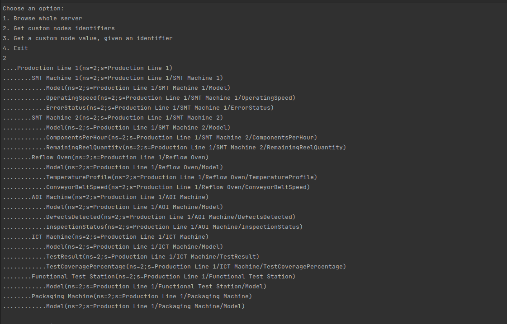
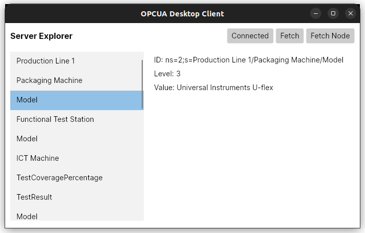

# OPC UA Server & Client Solution :gear: :computer:

[](.documentation/01_understanding_upc.md)

A minimal implementation of OPC UA server and client applications using C#.

_Don't know what UPC is? Follow the documentation._

## Overview :telescope:

This solution consists of two projects, `Server` and `Client`, which demonstrate the functionality of an OPC UA server and client respectively.

The solution showcases the following features:
- OPC UA server and client communication
- Secure communication using certificates
- Minimal implementation for easy understanding (albeit third party library is pretty weird)




## Getting Started :rocket:

To use this solution, follow these steps:

### 1. Build the Server

First, build the server project to generate the necessary certificates. At the root, run the following command:

```bash
dotnet build --project OPCUA-Server/
```

### 2. Build the Clients

Next, build the client project by running the following command:

```bash
dotnet build --project OPCUA-Client/
dotnet build --project OPCUA-Client-Desktop/
```

### 3. Run the Server and any of the Clients

Although it is not necessary to run the clients and server in order as the client will catch the connection error and report it to the user, the idea would be to: 

Start the OPC UA server by running the following command:

```bash
dotnet run --project OPCUA-Server/
```

The server will start and initialize the necessary certificates.


Finally, start one of the OPC UA clients:

```bash
dotnet run --project OPCUA-Client/
dotnet run --project OPCUA-Client-Desktop/
```

The client will connect to the OPC UA server and establish communication.

## Project Structure :file_folder:

The solution has the following project structure:

```text
Solution/
├── Server/
│   ├── ...
│   └── Server.csproj
├── Client/
│   ├── ...
│   └── Client.csproj
├── Desktop-Client/
│   ├── ...
│   └── Client.csproj
├── Solution.sln
└── README.md
```

- `Server/`: Contains the OPC UA server implementation.
- `Client/`: Contains the OPC UA client implementation.
- `Desktop-Client/`: Cross-platform Avalonia 11 MVVM desktop app with ReactiveUI.
- `Solution.sln`: The solution file for JetBrains Rider or other IDEs.
- `README.md`: This file, providing an overview and instructions for the solution.

## Dependencies :books:

The solution has dependencies on the following Nuget packages:
- `Opc.UaFx.Advanced`: OPC UA server library, in the OPCUA-Server project
- `Opc.UaFx.Client`: OPC UA client library, in the OPCUA-Client project(s)

Ensure that these dependencies are correctly retrieved with `dotnet restore`.

## Contributing :raised_hands:

Contributions to enhance this solution are welcome! If you find any issues or have ideas for improvements, feel free to create a pull request or submit an issue.

## License :page_with_curl:

This solution is licensed under the [MIT License](LICENSE.md).

Feel free to modify and add any additional information specific to your solution. Enjoy!
